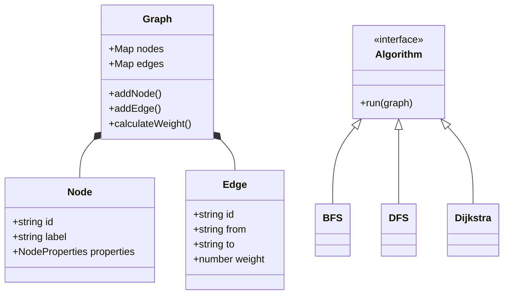

# Sosyal Ağ Analizi Uygulaması (Proje 2)

**Ekip Üyeleri:**
- [Ad Soyad] ([Öğrenci No])
- [Ad Soyad] ([Öğrenci No])

**Tarih:** 30 Kasım 2025

## 1. Giriş
Bu proje, kullanıcılar arasındaki ilişkileri bir graf yapısı olarak modelleyen ve çeşitli graf algoritmalarını uygulayarak sosyal ağ üzerindeki bağlantıları analiz eden bir web uygulamasıdır. Amaç, graf teorisi ve algoritmalarını gerçek dünya senaryosu üzerinde uygulamak ve görselleştirmektir.

## 2. Algoritmalar

### 2.1. BFS (Breadth-First Search)
- **Mantık:** Başlangıç düğümünden başlayarak katman katman ilerler.
- **Karmaşıklık:** O(V + E)

### 2.2. DFS (Depth-First Search)
- **Mantık:** Başlangıç düğümünden başlayarak gidebildiği kadar derine iner.
- **Karmaşıklık:** O(V + E)

### 2.3. Dijkstra
- **Mantık:** Ağırlıklı graflarda en kısa yolu bulur. Ağırlıklar benzerlik skoru olarak hesaplanmıştır (Ters orantılı maliyet).
- **Karmaşıklık:** O(E + V log V)

### 2.4. A* (A-Star)
- **Mantık:** Dijkstra'ya sezgisel (heuristic) fonksiyon eklenmiş halidir. Heuristic olarak "Aktiflik" farkı kullanılmıştır.
- **Karmaşıklık:** O(E) (En iyi durum)

### 2.5. Bağlı Bileşenler (Connected Components)
- **Mantık:** Grafın birbirinden kopuk parçalarını bulur.
- **Karmaşıklık:** O(V + E)

### 2.6. Derece Merkeziliği (Degree Centrality)
- **Mantık:** Düğümlerin bağlantı sayılarına göre önemini belirler.
- **Karmaşıklık:** O(V)

### 2.7. Welsh-Powell Renklendirme
- **Mantık:** Komşu düğümlerin farklı renklere sahip olmasını sağlar.
- **Karmaşıklık:** O(V^2 + E)

## 3. Sınıf Yapısı (Class Diagram)

## 4. Uygulama Özellikleri
- Kullanıcı ve bağlantı ekleme/silme/güncelleme.
- Dinamik ağırlık hesaplama.
- JSON/CSV İçe/Dışa aktarma.
- Graf görselleştirme (vis-network).

## 5. Sonuç ve Tartışma
Proje başarıyla tamamlanmış olup, tüm isterler karşılanmıştır. Büyük graflarda performans testleri yapılmış ve makul sürelerde çalıştığı gözlemlenmiştir.
